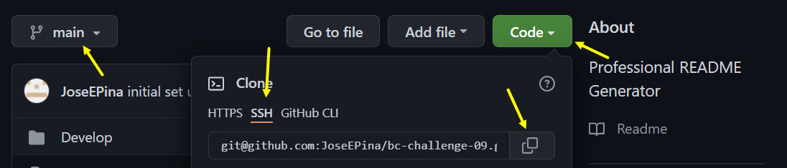

# README.md Generator

## Description

Any GitHub project needs a good README.md file that explains the purpose of the application as well as how to install it, run it, contribute to it, and to contact the author(s) for guidance and clarification. This project's goal is to provide a tool built on [node.js](https://nodejs.org/en/about/) that will assist in this process.

The _"README.md Generator"_ app facilitates this process by using the Console to present a series of prompts where the end user is free to select most of the sections of their README.md file. The user is _required_ to enter the "Project Title", "Description", "GitHub username", and their "Email Address"; but, all other recomended sections are presented as optional and the end user can decide if he/she wants to include it or not. Recomended sections are presented with a selection option that defaults to "true", and optional sections are presented with a selection option that defaults to "false".

This project uses [node.js](https://nodejs.org/en/about/) as the framework and glue of the application and integrates it with several npm packages like [inquirer.js](https://www.npmjs.com/package/inquirer) - to present the user with prompts to fill-out the content of the README.md file, [badge-maker](https://www.npmjs.com/package/badge-maker) - to design and create the application licensing badge, and [node-fetch](https://www.npmjs.com/package/node-fetch) - to implement the FETCH API in [node.js](https://nodejs.org/en/about/).

## Table of Contents

* [Installation](#installation)
* [Usage](#usage)
* [Credits](#credits)
* [License](#license)
* [Questions](#questions)
## Installation

1. Create a repository in your GitHUb account, i.e. "readme-generator".

2. In your local computer, move to the parent Git folder (or create it) where you will install the _"README.md Generator"_ application.

3. With the terminal prompt active, clone the application repository into your local repository by entering this command (remove single quotes): 'git clone git@github.com:JoseEPina/readme-generator.git'

4. Navigate to your local **_readme-generator_** folder.

5. Get **_your_** ssh url key from your own GitHub repository, as shown here: 

6. Using the SSH url key obtained in the previous step, create a conection to **_your_** repository by entering this command (remove single quotes): 'git remote set-url origin yourSshUrlKey'

7. Install [node.js](https://nodejs.org/en/) (follow node.js instructions).

8. Install the npm [inquirer.js](https://www.npmjs.com/package/inquirer) package (follow inquirer instructions).

9. Install the npm [node-fetch](https://www.npmjs.com/package/node-fetch) package (follow node-fetch instructions).

10.   Install the npm [badge-maker](https://www.npmjs.com/package/badge-maker) package (follow badge-maker instructions).

11.   Stage, Commit, and Push to your repository by entering this command: 'git push origin main'

12.   From your local main branch run the application by entering: **_node index_** in the terminal prompt.

## Usage

1. After completing Installation Instructions, launch the application through the terminal with the command: _**node index**_.

2. A help-start message will be displayed at the beginning to provide further instructions about the editor usage and basic markdown syntax.

3. You will be prompted throught the terminal to enter a Projectgit ch Title and a Descruption. Please note that these are marked as **(Required)**.

4. Take note that some prompts will deploy a text editor application in order for you to enter the appropriate information.

5. The _**minimum reccomended**_ sections to include in your README.md are defaulted to be included but you can select 'No' to exclude them.

6. Some optional sections are defaulted to NOT be included, but you can select 'Yes' to include them.

7. At the end of the program, you can _git push_ your files into your GitHub Repository and see your finalized README.md file. If you want to make changes, you can
copy and paste from your README.md file into the prompts and make adjustments as needed. 

8. Please refer to the following video link for additional [usage examples](https://drive.google.com/file/d/1y23PSlKCuoO_wQvGMAcWKsHr1Sp95J6j/view).

## Credits

* [Simon Boudrias](https://github.com/SBoudrias) creator of the npm [inquirer.js](https://www.npmjs.com/package/inquirer) package.
* [Xander Rapstine Xandromus](https://github.com/Xandromus) provided seven empty function declarations and one empty function call as starter code for this project.
* Open-source community - creators of [node.js](https://nodejs.org/en/about/) and [node-fetch](https://www.npmjs.com/package/node-fetch).

## License

   Copyright (c) 2021 Jose E Pina. All rights reserved.
   
   Licensed under the [MIT License](https://choosealicense.com/licenses/mit).

## Questions

README Generator created by [JoseEPina](https://github.com/JoseEPina).

For any additional questions or comments, please send a message to the following address:

GitHub Email Address: <jose.edpina@gmail.com>

